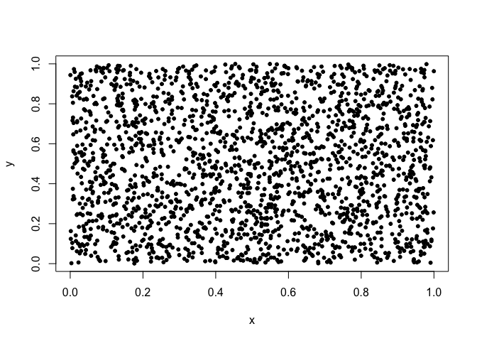
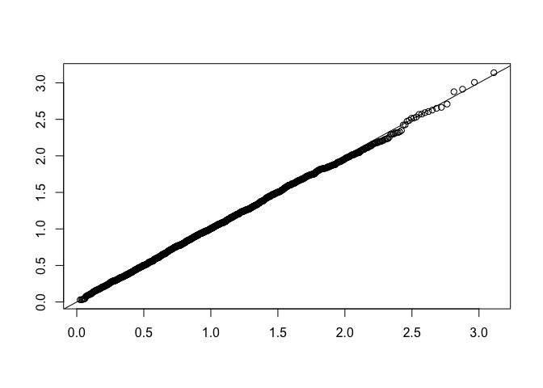
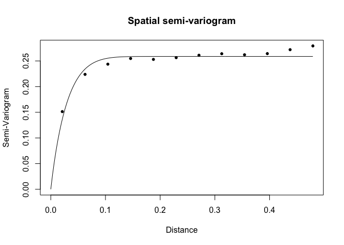
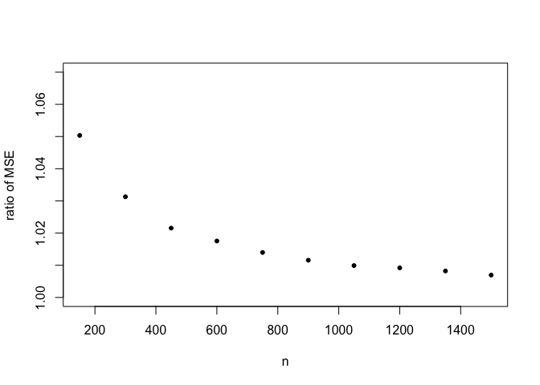
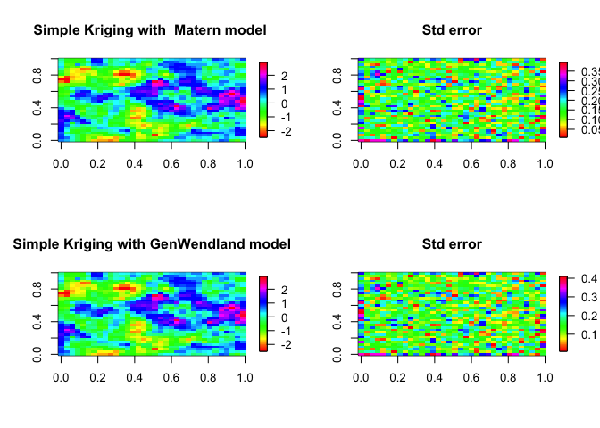

-   [Weibull](#weibull)
-   [Matern vs Gen\_Wendland from simple kriging point of
    view](#matern-vs-gen_wendland-from-simple-kriging-point-of-view)

Weibull
-------

Let's clear space and load required libraries

    rm(list=ls())
    library(GeoModels)
    require(fields)

    ## Loading required package: fields

    ## Loading required package: spam

    ## Loading required package: dotCall64

    ## Loading required package: grid

    ## Spam version 2.1-2 (2017-12-21) is loaded.
    ## Type 'help( Spam)' or 'demo( spam)' for a short introduction 
    ## and overview of this package.
    ## Help for individual functions is also obtained by adding the
    ## suffix '.spam' to the function name, e.g. 'help( chol.spam)'.

    ## 
    ## Attaching package: 'spam'

    ## The following objects are masked from 'package:base':
    ## 
    ##     backsolve, forwardsolve

    ## Loading required package: maps

    require(gsl)

    ## Loading required package: gsl

Set model:

    model="Weibull"

Set the coordinates of the points:

    N=2000
    x <- runif(N, 0, 1)
    y <- runif(N, 0, 1)
    coords=cbind(x,y)
    plot(coords,pch=20)

Regression parameters and matrix covariates in the case of one mean
parameter the X is not necessary

    mean <- -0.3; mean1=0.5
    X=cbind(rep(1,N),runif(N))
    ## sill+nugget=1; nugget=0 if the RF is mean square continous
    nugget <- 0
    sill <- 1-nugget
    # shape of the  weibull RF
    shape=2
    ## correlation model and parameters
    corrmodel <- "Wend0"
    scale <- 0.3
    power2=4

Simulation:

    param=list(mean=mean,mean1=mean1,sill=sill, nugget=nugget,
               scale=scale,power2=power2,shape=shape)
    set.seed(312)
    # Simulation of the non stationary  Weibull random field:
    data <- GeoSim(coordx=coords, corrmodel=corrmodel, model=model,param=param,
                   X=X,sparse=TRUE)$data

    #covariance matrix of the Weibull RF
    #CC<- GeoCovmatrix(coordx=coords, corrmodel=corrmodel,model=model,X=X,
     #             param=param)$covmat

Estimation with pairwise likelihood:

    start=list(mean=mean,mean1=mean1,scale=scale,shape=shape)
    fixed=list(sill=sill,nugget=nugget,power2=power2)
    # Maximum composite-likelihood fitting of the Weibull random field:
    fit <- GeoFit(data=data,coordx=coords, corrmodel=corrmodel,model=model,X=X,
                        start=start,fixed=fixed,maxdist=0.02)
                        #GPU = 0,local = c(1,1))

    fit

    ## 
    ## ##################################################################
    ## Maximum Composite-Likelihood Fitting of Weibull Random Fields
    ## 
    ## Setting: Marginal Composite-Likelihood 
    ## 
    ## Model associated to the likelihood objects: Weibull 
    ## 
    ## Type of the likelihood objects: Pairwise 
    ## 
    ## Covariance model: Wend0 
    ## Number of spatial coordinates: 2000 
    ## Number of dependent temporal realisations: 1 
    ## Type of the random field: univariate 
    ## Number of estimated parameters: 4 
    ## 
    ## Type of convergence: Successful 
    ## Maximum log-Composite-Likelihood value: -2602.93
    ## 
    ## Estimated parameters:
    ##    mean    mean1    scale    shape  
    ## -0.2837   0.4518   0.3538   1.8575  
    ## 
    ## ##################################################################

Computing residuals:

    res=GeoResiduals(fit)
    ### checking model assumptions: marginal distribution
    probabilities = (1:N)/(N+1)
    weibull.quantiles = qweibull(probabilities, shape=shape, scale = 1/(gamma(1+1/shape)))
    plot(sort(weibull.quantiles), sort(c(res$data)),xlab="",ylab="")
    abline(0,1)

    ### checking model assumptions: covariance model
    vario <- GeoVariogram(data=res$data,coordx=coords,maxdist=0.5)
    GeoCovariogram(res,show.vario=TRUE, vario=vario,pch=20)

Kriging:

    colour <- rainbow(100)

    par(mfrow=c(1,3))
    #### map of  data
    quilt.plot(x, y, data,col=colour,main="Data")                
    # locations to predict  and associated covariates
    xx<-seq(0,1,0.015)
    loc_to_pred<-as.matrix(expand.grid(xx,xx))
    Nloc=nrow(loc_to_pred)
    Xloc=cbind(rep(1,Nloc),runif(Nloc))

    ## simple kriging 
    pr<-GeoKrig(data=data, coordx=coords,loc=loc_to_pred, X=X,Xloc=Xloc,
        corrmodel=corrmodel,model=model,mse=TRUE,
           sparse=TRUE,param= param)

    #standard   gamma kriging
    map=matrix(pr$pred,ncol=length(xx))
    image.plot(xx, xx, map,col=colour,xlab="",ylab="",main="Simple Kriging ")
    #associated mean squared error
    map_mse=matrix(pr$mse,ncol=length(xx))
    image.plot(xx, xx, map_mse,col=colour,xlab="",ylab="",main="std err ")

Matern vs Gen\_Wendland from simple kriging point of view
---------------------------------------------------------

Let's clear space and load required libraries

    rm(list=ls())
    library(GeoModels)
    library(fields)

Set parameters:

    mean<-0
    nugget<-0
    sill<-1
    # Set the Matern covariance parameters:
    corrmodel_1 <- "Matern"
    scale<-0.3/3
    smooth=0.5
    param<-list(mean=mean,sill=sill,nugget=nugget,scale=scale,smooth=smooth)
    # Set the GenWendland covariance parameters 
    corrmodel_2 <- "GenWend"
    power2=3
    c_supp<-0.3
    smooth_wen=0
    param_wen<-list(mean=mean,sill=sill,nugget=nugget,scale=c_supp,
                   power2=power2,smooth=smooth_wen)

Under this setting the correlations are compatible i.e. the induced
Gaussian RF are equivalent (see Bevilacqua M., Faouzi T., Furrer R.,
Porcu E. (2018). Estimation and prediction using generalized Wendland
covariance function under fixed domain asymptotics. Annals of
Statistics. To appear )

    set.seed(79)

    k=1
    ratio_mse=NULL

    while(k<=10)
    {

    # location sites 
    x <- runif(150*k, 0, 1)
    y <- runif(150*k, 0, 1)
    coords<-cbind(x,y)

    # Simulation of the spatial Gaussian RF under the true  Matern correlation
    data <- GeoSim(coordx=coords, corrmodel=corrmodel_1,
                  param=param)$data

    # locations to predict
    xx<-seq(0,1,0.03)
    loc_to_pred<-as.matrix(expand.grid(xx,xx))

    ################################################################
    ### Simple kriging under the true  Matern correlation
    ###############################################################
    pr_mat<-GeoKrig(loc=loc_to_pred,coordx=coords,corrmodel=corrmodel_1,
           param= param, data=data,mse=TRUE)
    ################################################################
    ### Simple kriging under the misspecified  Gen_wendland correlation
    ###############################################################
    pr_wen=GeoKrig(loc=loc_to_pred,coordx=coords,corrmodel=corrmodel_2,data=data,
           param=param_wen,sparse=TRUE,mse=TRUE)

    ## computing mean of ratios
    ratio_mse=c(ratio_mse,mean(pr_wen$mse/pr_mat$mse))
    k=k+1
    print(k)
    }

    ## [1] 2
    ## [1] 3
    ## [1] 4
    ## [1] 5
    ## [1] 6
    ## [1] 7
    ## [1] 8
    ## [1] 9
    ## [1] 10
    ## [1] 11

Plotting (increasing) number of location sites vs ratio of MSE. Under
fixed domain asymptotics the ratio converge to 1 i.e. prediction and MSE
are asymptotically equivalent

    k=1:10
    plot(150*k,ratio_mse,ylim=c(1,1.07),xlab="n",ylab="ratio of MSE",pch=20)

    colour <- rainbow(100)
    par(mfrow=c(2,2))
    # simple kriging map prediction
    image.plot(xx, xx, matrix(pr_mat$pred,ncol=length(xx)),col=colour,
               xlab="",ylab="",
               main="Simple Kriging with  Matern model ")

    # simple kriging map prediction variance
    image.plot(xx, xx, matrix(pr_mat$mse,ncol=length(xx)),col=colour,
               xlab="",ylab="",main="Std error")

    # simple tapered kriging map prediction
    image.plot(xx, xx, matrix(pr_wen$pred,ncol=length(xx)),col=colour,
               xlab="",ylab="",main="Simple Kriging with GenWendland model")

    # simple kriging map prediction variance
    image.plot(xx, xx, matrix(pr_wen$mse,ncol=length(xx)),col=colour,
               xlab="",ylab="",main="Std error")

